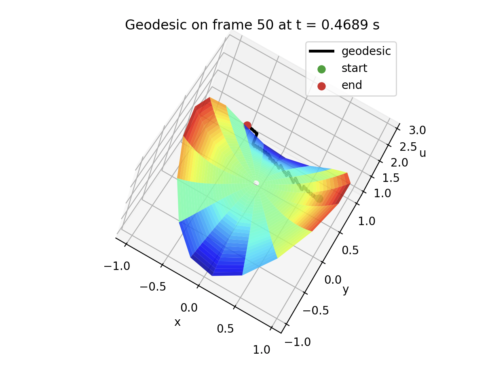
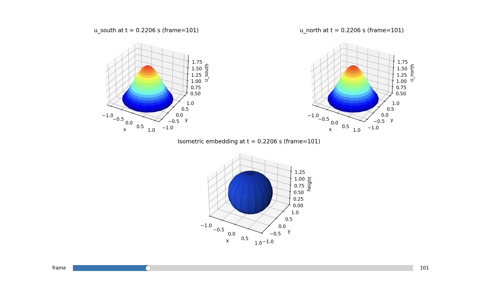

# Heat Diffusion and Geodesics
We're modeling heat diffusion and investigating curvature. This process began with simple simulations of heat diffusion on a 1D rod, and then a 2D surface. Then we began varying the boundary conditions, and transitioned to simulations in polar coordinates using the polar form for the laplacian.

Our long-term goal is to model curvature flow on Riemann surfaces with prescribed conical singularities, producing the uniformization metrics whose existence was establish in *Ricci flow on surfaces with conic singularities* (2015) by Mazzeo, Rubinstein, Sesum.

Last changes:
We now run the sim by running `curvature_flow.py`, and I renamed `weight_to_geodesic.py` to `geodesic_calc.py`.

### Installation
To run the simulations, you'll need to install `python`, and run
```powershell
pip3 install numpy
```
```powershell
pip3 install matplotlib
```
to install the necessary stack.

## Editing Simulation Parameters
The parameters for the `curvature_flow.py` and `geodesic_calc.py` simulations can be edited in the `heat_simulations/polar/2D/config.py` file. The function calls at the bottom of each file load the variables from config.


## Calculating Geodesics
The  `sim_in_polar()` function in `curvature_flow.py` calls functions from `geodesic_calc.py` to plot the geodesic on the weight function, and allows the user to scroll through the frames with a slider.

To calulate a geodesic and plot a geodesic, edit the variables in `heat_simulations/polar/2D/config.py` to whatever you want and then run 
```powershell
python3 heat_simulations/polar/2D/curvature_flow.py
```
from the root directory (or just run the python file). After closing the first pop-up window, you should see the trajectory overlayed on the curvature plot.

This config file was used to generate the below image:
```python
# --- Curvature flow params --- #
A = 1
T = 1
Nr = 50
Ntheta = 50

# can be True, False, "single"
CURVE_PLOT = "single" # Show curvature flow plot, or show a single frame with "single"
SAVE_EVERY = 200 # How often we save the state to a new frame
BETA = 0
RHO = 0

# --- Geodesic params --- #
P = 0.75 + 0.0j
V = -0.5 + 0.35j
U_IDX = 50 # determines which weight function from the frames object will be used
STEPS = 5000
GEO_PLOT = True # Show geodesic path
```
This configuration produced this image:



## heat_simulations
### `heat_simulations/first_passes`
In `first_passes`, you'll find the first simulations we created, like the initial 1D and 2D models, as well as experiments with more interesting boundary conditions. With `bounds_time_stack` we made our first attempt at storing all values and plotting all at once.

### `heat_simulations/polar`
In `polar`, you'll find our two directories:
### 2D:
In the `polar/2D` directory, we have the `curvature_flow.py`, `curvature_flow_on_sphere.py` and the `polar_2d.py` modules. 
`curvature_flow.py` is a simulation of (unnormalized) Ricci flow using the PDE $u_t=\Delta\log u$. Notice that the `sim_in_polar()` function takes default parameters for `a` (the diffusivity constant), `t` (the time interval over which we simulate), as well as the number of radial and angular samples. At the bottom of the file, you can tweak the parameters as you wish. Run the file to see the simulation. Here is an example: 


`polar_2d.py` is a simulation of classical heat flow, done in polar coordinates. You can similarly adjust the paramters as you wish. Here is a cool example from at two different time points: 


`curvature_flow_on_sphere.py` is a simulation of Yamabe flow on a sphere. This is a work in progress, and is not yet fully implemented. Here is an example of the glueing from south and north pole: 

### symmetric:
In the `polar/symmetric` folder are our first simulations in polar coordinates, which use radially symmetric initial conditions, allowing us to omit the angular derivative component of the laplacian. Here's an example of the one simulating curvature over a disk: 


## Log
Implemented geodesics. Through task #1 in TODO. Maybe we should store simulation data in a database so we don't need to run it every time.

## TODO
0. Refactor codebase so that modules are in the correct folders, it doesn't really make sense right now. We need to move curvature things out of heat_sims and maybe consolidate all geodesics work.

1. Plot the geodesic over the curvature_flow plot
   - z = u would plot it in 3d along the surface
   - need to implement a function to plot only a single frame (config.U_IDX), with no slider

2. From sim_in_polar(), call geodesic() at every frame
   - change geodesic() first few lines

2_5. side-by side where we can increase the curvature (bump in middle) and watch the geodesic change on a diff window
3. Apply these methods to the sphere

4. Mess with singularities and effects on geodesics and average curvature

4. Evententually remove the slider and animate it for presentation